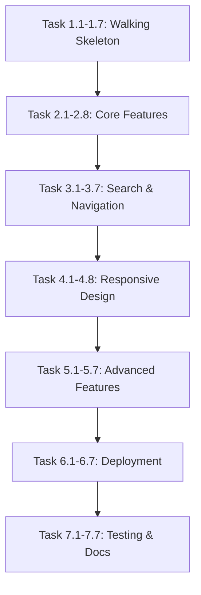

# Product Requirements Document: 个人技术博客 (Personal Tech Blog)

## Metadata

| Field | Value |
|-------|-------|
| **Created** | 2026-01-17 |
| **Last Updated** | 2026-01-17 |
| **Status** | draft |
| **Version** | 1.0 |
| **Author** | Claude + cong |

---

## 1. Executive Summary

构建一个基于 Next.js 的静态博客系统，作为个人技术知识库和备忘录。核心功能包括快速全文检索、移动端友好、优秀的代码高亮和阅读体验。采用本地 Markdown + Git 管理内容，生成纯静态文件部署到 Vercel，确保长期可用且无服务端依赖。

---

## 2. Problem Statement

### Pain Points

- **知识分散难以检索** - 技术笔记散落在各处，需要时无法快速找到
- **写作流程繁琐** - 现有博客系统发布流程复杂，导致懒得记录
- **服务依赖风险** - 第三方博客服务可能关闭，内容永久丢失风险
- **代码展示糟糕** - 大多数博客代码高亮和阅读体验不佳

### Current State

目前使用零散的笔记工具或简单的文档记录，但缺乏：
- 全文搜索能力
- 良好的移动端体验
- 专业的代码高亮
- 版本管理和备份机制

### Why Now?

- Next.js SSG 成熟稳定，构建速度快
- Vercel 免费部署方案完善
- 个人知识积累到需要系统化管理
- 技术栈熟悉度高，实施成本低

---

## 3. Success Metrics & Kill Criteria

### Success Metrics (SMART)

- [ ] **快速检索**: 全文搜索响应时间 < 500ms，能搜索到所有文章内容
- [ ] **移动端友好**: Google Lighthouse 移动端评分 > 90
- [ ] **构建速度**: SSG 构建时间 < 2 分钟（100 篇文章以内）
- [ ] **部署稳定**: Vercel 自动部署成功率 100%
- [ ] **内容可迁移**: 所有内容以纯 Markdown 格式存储，可一键迁移到其他平台

### Kill Criteria

- 如果构建时间超过 5 分钟，需要优化或考虑切换到增量静态生成（ISR）
- 如果移动端体验差（Lighthouse < 70），需要重新设计响应式布局
- 如果搜索功能无法正常工作，必须修复才能发布

---

## 4. User Stories / Jobs to Be Done

### Primary Persona: 技术工作者（作者本人）

> 资深开发者，需要记录和检索技术知识，重视写作流畅度和阅读体验，不需要考虑读者反馈功能

### Jobs to Be Done (JTBD)

> **When** 遇到技术问题或学到新知识时，**I want to** 快速记录下来，**so I can** 以后快速查阅和应用

- **Job 1**: When 我需要查找之前记录的某个技术点，I want to 通过关键词搜索快速定位文章，so I can 节省翻找时间
- **Job 2**: When 我在手机上需要查看某篇技术文章，I want to 获得良好的阅读体验，so I can 随时随地获取信息
- **Job 3**: When 我写完一篇文章，I want to 通过简单的 git push 就能发布，so I can 专注于内容而非发布流程

### Core User Stories

- [ ] **US-001**: 作为博客作者，我想要看到所有文章列表，以便快速导航到目标文章
  - **Acceptance Criteria**:
    - [ ] 首页展示文章列表（标题、摘要、日期、标签）
    - [ ] 支持按日期倒序排列
    - [ ] 支持点击标签筛选相关文章
    - [ ] 每篇文章显示阅读时间估算
  - **Priority**: P0

- [ ] **US-002**: 作为博客作者，我想要阅读单篇文章，以便获取完整的技术内容
  - **Acceptance Criteria**:
    - [ ] 支持 Markdown 完整渲染（标题、列表、引用、表格等）
    - [ ] 代码块支持语法高亮（至少支持主流语言）
    - [ ] 右侧显示文章目录（TOC），点击可跳转
    - [ ] 文章底部显示相关文章推荐
  - **Priority**: P0

- [ ] **US-003**: 作为博客作者，我想要搜索文章内容，以便快速找到需要的信息
  - **Acceptance Criteria**:
    - [ ] 搜索框在页面顶部固定显示
    - [ ] 支持搜索标题、正文、标签
    - [ ] 搜索结果高亮显示匹配关键词
    - [ ] 搜索响应时间 < 500ms
  - **Priority**: P0

- [ ] **US-004**: 作为博客作者，我想要在手机上阅读博客，以便随时随地获取信息
  - **Acceptance Criteria**:
    - [ ] 所有页面在移动设备上自适应布局
    - [ ] 触摸交互友好（按钮大小适中、无误触）
    - [ ] 横屏和竖屏都能正常显示
    - [ ] 图片自适应屏幕宽度
  - **Priority**: P0

- [ ] **US-005**: 作为博客作者，我想要通过 Markdown 编写文章，以便专注于内容创作
  - **Acceptance Criteria**:
    - [ ] 文章以 `.md` 文件存储在 `posts/` 目录
    - [ ] 支持 Frontmatter 定义元数据（标题、日期、标签、摘要）
    - [ ] 支持 MDX（可在 Markdown 中使用 React 组件）
    - [ ] 代码块自动检测语言并高亮
  - **Priority**: P0

- [ ] **US-006**: 作为博客作者，我想要深色极简的界面风格，以便获得舒适的阅读体验
  - **Acceptance Criteria**:
    - [ ] 默认深色主题，配色为深灰色 + 橙色点缀
    - [ ] 界面简洁，无多余装饰元素
    - [ ] 字体清晰易读（代码使用等宽字体）
    - [ ] 良好的留白和排版
  - **Priority**: P0

- [ ] **US-007**: 作为博客作者，我想要将博客部署到 Vercel，以便自动化发布流程
  - **Acceptance Criteria**:
    - [ ] Git push 到 main 分支自动触发构建
    - [ ] 构建成功后自动部署到 Vercel
    - [ ] 部署时间 < 3 分钟
    - [ ] 支持自定义域名（可选）
  - **Priority**: P1

---

## 5. Functional Requirements

### Core Features

- [ ] **FR-001**: 文章列表页
  - Priority: P0
  - Dependencies: None
  - Notes: 显示所有已发布的文章，支持分页或无限滚动

- [ ] **FR-002**: 文章详情页
  - Priority: P0
  - Dependencies: FR-001
  - Notes: 完整的 Markdown 渲染，支持代码高亮和数学公式

- [ ] **FR-003**: 全文搜索
  - Priority: P0
  - Dependencies: FR-001
  - Notes: 使用 FlexSearch 实现客户端搜索，搜索索引在构建时生成

- [ ] **FR-004**: 响应式设计
  - Priority: P0
  - Dependencies: None
  - Notes: 使用 Tailwind CSS 实现移动端优先的响应式布局

- [ ] **FR-005**: 代码高亮
  - Priority: P0
  - Dependencies: FR-002
  - Notes: 使用 Shiki 实现类似 VSCode 的代码高亮

- [ ] **FR-006**: 文章分类和标签
  - Priority: P0
  - Dependencies: FR-001
  - Notes: 从 Frontmatter 提取标签，支持标签筛选

- [ ] **FR-007**: 文章目录（TOC）
  - Priority: P1
  - Dependencies: FR-002
  - Notes: 自动提取文章标题生成目录，支持点击跳转

- [ ] **FR-008**: 数学公式和图表
  - Priority: P1
  - Dependencies: FR-002
  - Notes: 支持 KaTeX/LaTeX 数学公式和 Mermaid 图表

- [ ] **FR-009**: Vercel 部署配置
  - Priority: P1
  - Dependencies: None
  - Notes: 配置 GitHub 集成实现自动部署

- [ ] **FR-010**: 内容抽象层
  - Priority: P1
  - Dependencies: None
  - Notes: 设计内容获取接口，便于未来迁移到 Notion/Obsidian

### Out of Scope (Explicit)

These items are explicitly NOT part of this project:

- **评论系统** — 不需要读者互动功能
- **用户注册/登录** — 只有作者一人使用
- **RSS 订阅** — 暂不需要，后续可添加
- **文章访问统计** — 不关注读者数据
- **点赞/收藏功能** — 不需要社交功能
- **多语言支持** — 暂时只有中文
- **在线编辑器** — 使用本地编辑器编写

---

## 6. Technical Specifications

### Tech Stack

| Layer | Technology | Notes |
|-------|------------|-------|
| Frontend | Next.js 14+ | 使用 App Router 和 SSG |
| Styling | Tailwind CSS | 移动端优先的响应式设计 |
| Content | MDX | 支持 Markdown + React 组件 |
| Code Highlighting | Shiki | VSCode 同款高亮 |
| Search | FlexSearch | 客户端全文搜索 |
| Math | KaTeX | 数学公式渲染 |
| Diagrams | Mermaid | 流程图、时序图等 |
| Deployment | Vercel | 自动部署和 CDN |
| Version Control | Git | 内容版本管理 |

### Architecture Overview

```
┌─────────────────────────────────────────────────────────┐
│                     User Browser                        │
└─────────────────────────────────────────────────────────┘
                            ↓
┌─────────────────────────────────────────────────────────┐
│                   Vercel Edge Network                   │
│              (CDN + Static Hosting)                     │
└─────────────────────────────────────────────────────────┘
                            ↓
┌─────────────────────────────────────────────────────────┐
│              Next.js Static Site (SSG)                  │
│  ┌──────────────┐  ┌──────────────┐  ┌──────────────┐ │
│  │ Index Page   │  │ Article Page │  │ Search Index │ │
│  └──────────────┘  └──────────────┘  └──────────────┘ │
└─────────────────────────────────────────────────────────┘
                            ↑
┌─────────────────────────────────────────────────────────┐
│              Content Layer (Abstract)                   │
│  ┌──────────────┐  ┌──────────────┐                    │
│  │ Local MDX    │  │ Future:      │                    │
│  │ Files        │  │ Notion/      │                    │
│  │              │  │ Obsidian     │                    │
│  └──────────────┘  └──────────────┘                    │
└─────────────────────────────────────────────────────────┘
                            ↑
┌─────────────────────────────────────────────────────────┐
│                  Git Repository                         │
│            (Content + Code Versioning)                  │
└─────────────────────────────────────────────────────────┘
```

### Data Models

#### Article (Frontmatter Schema)

```typescript
interface ArticleFrontmatter {
  title: string;           // 文章标题
  date: string;            // 发布日期 (YYYY-MM-DD)
  summary?: string;        // 文章摘要（可选）
  tags?: string[];         // 标签列表（可选）
  category?: string;       // 分类（可选）
  draft?: boolean;         // 是否为草稿（默认 false）
  readingTime?: number;    // 阅读时间分钟（自动计算）
}
```

#### Content Provider Interface (Abstract)

```typescript
interface ContentProvider {
  getAllArticles(): Promise<Article[]>;
  getArticleBySlug(slug: string): Promise<Article | null>;
  getArticlesByTag(tag: string): Promise<Article[]>;
  searchArticles(query: string): Promise<Article[]>;
}

// Local MDX Implementation
class LocalMDXProvider implements ContentProvider {
  // Read from /posts directory
}

// Future: Notion Implementation
class NotionProvider implements ContentProvider {
  // Read from Notion API
}
```

### File Structure

```
cc-automatic-blog-project/
├── posts/                    # 所有文章源文件
│   ├── 2024-01-17-nextjs-blog-setup.md
│   ├── 2024-01-18-react-hooks-guide.md
│   └── ...
├── public/                   # 静态资源
│   ├── images/
│   └── favicon.ico
├── src/
│   ├── app/                  # Next.js App Router
│   │   ├── layout.tsx        # 根布局
│   │   ├── page.tsx          # 首页（文章列表）
│   │   ├── blog/
│   │   │   ├── [slug]/
│   │   │   │   └── page.tsx  # 文章详情页
│   │   │   └── tag/
│   │   │       └── [tag]/
│   │   │           └── page.tsx  # 标签筛选页
│   │   └── about/
│   │       └── page.tsx      # 关于页面
│   ├── components/           # React 组件
│   │   ├── ArticleCard.tsx
│   │   ├── CodeBlock.tsx
│   │   ├── SearchBox.tsx
│   │   ├── TOC.tsx
│   │   └── ...
│   ├── lib/
│   │   ├── content.ts        # 内容抽象层
│   │   ├── providers/
│   │   │   └── local-mdx.ts  # 本地 MDX 实现
│   │   └── search.ts         # 搜索索引生成
│   └── styles/
│       └── globals.css       # 全局样式
├── next.config.js            # Next.js 配置
├── tailwind.config.js        # Tailwind 配置
└── package.json
```

---

## 7. Implementation Phases

*Each task should be completable in 1-4 hours (roughly one PR/commit).*

### Phase 1: Walking Skeleton (Foundation)

**Goal**: Basic Next.js project setup with one article page working.

- [x] **Task 1.1**: Initialize Next.js 14 project with TypeScript and Tailwind CSS
- [x] **Task 1.2**: Configure project structure (create directories and base files)
- [x] **Task 1.3**: Set up MDX support (install @next/mdx and configure)
- [x] **Task 1.4**: Create first sample article in `/posts` directory with Frontmatter
- [x] **Task 1.5**: Implement basic layout with dark theme (深灰色 + 橙色配色)
- [x] **Task 1.6**: Create article detail page at `/blog/[slug]` that renders MDX
- [x] **Task 1.7**: Deploy to Vercel and verify basic build works

**Phase 1 Verification**: 访问任意一篇文章的 URL 能正确渲染 Markdown 内容，部署到 Vercel 成功

---

### Phase 2: Core Features (MVP)

**Goal**: 完成核心阅读体验功能。

- [x] **Task 2.1**: Implement content provider interface and local MDX implementation
- [x] **Task 2.2**: Create article list page (`/`) showing all articles
- [x] **Task 2.3**: Add article metadata display (date, tags, reading time)
- [x] **Task 2.4**: Implement Shiki code highlighting for code blocks
- [x] **Task 2.5**: Add article card component with hover effects
- [x] **Task 2.6**: Implement tag filtering functionality
- [x] **Task 2.7**: Create tag page at `/blog/tag/[tag]`
- [x] **Task 2.8**: Add About page

**Phase 2 Verification**: 能浏览文章列表、点击进入文章详情、按标签筛选文章

---

### Phase 3: Search & Navigation

**Goal**: 实现搜索和导航功能。

- [ ] **Task 3.1**: Integrate FlexSearch for client-side search
- [ ] **Task 3.2**: Generate search index at build time
- [ ] **Task 3.3**: Create search box component with live results
- [ ] **Task 3.4**: Add keyboard shortcut for search (Cmd+K)
- [ ] **Task 3.5**: Implement article table of contents (TOC)
- [ ] **Task 3.6**: Add smooth scrolling for TOC links
- [ ] **Task 3.7**: Add "Back to top" button

**Phase 3 Verification**: 搜索功能正常工作，TOC 能正确导航到文章各章节

---

### Phase 4: Responsive Design & Polish

**Goal**: 完善移动端体验和细节优化。

- [ ] **Task 4.1**: Implement mobile-first responsive design for all pages
- [ ] **Task 4.2**: Add mobile navigation menu (hamburger menu)
- [ ] **Task 4.3**: Optimize typography for mobile reading
- [ ] **Task 4.4**: Add loading states and skeleton screens
- [ ] **Task 4.5**: Add 404 page
- [ ] **Task 4.6**: Add image optimization (next/image)
- [ ] **Task 4.7**: Implement dark/light theme toggle (optional)
- [ ] **Task 4.8**: Add favicon and meta tags for SEO

**Phase 4 Verification**: 移动端 Lighthouse 评分 > 90，所有页面在不同设备上正常显示

---

### Phase 5: Advanced Features

**Goal**: 添加数学公式、图表等高级功能。

- [ ] **Task 5.1**: Integrate KaTeX for math formula rendering
- [ ] **Task 5.2**: Create MDX component for math equations
- [ ] **Task 5.3**: Integrate Mermaid for diagrams
- [ ] **Task 5.4**: Add syntax highlighting for Mermaid code blocks
- [ ] **Task 5.5**: Add related articles section at bottom of articles
- [ ] **Task 5.6**: Implement reading time estimation
- [ ] **Task 5.7**: Add copy button to code blocks

**Phase 5 Verification**: 数学公式和图表能正确渲染，相关文章推荐合理

---

### Phase 6: Deployment & CI/CD

**Goal**: 完善部署流程和自动化。

- [ ] **Task 6.1**: Configure Vercel project with GitHub integration
- [ ] **Task 6.2**: Set up automatic deployment on push to main branch
- [ ] **Task 6.3**: Add build optimization (bundle analysis)
- [ ] **Task 6.4**: Configure custom domain (if applicable)
- [ ] **Task 6.5**: Set up environment variables for any API keys
- [ ] **Task 6.6**: Add pre-deployment checks (type checking, linting)
- [ ] **Task 6.7**: Create deployment documentation

**Phase 6 Verification**: Git push 后自动部署成功，无构建错误

---

### Phase 7: Testing & Documentation

**Goal**: 确保代码质量和可维护性。

- [ ] **Task 7.1**: Add unit tests for utility functions
- [ ] **Task 7.2**: Add integration tests for critical flows
- [ ] **Task 7.3**: Set up E2E tests with Playwright (optional)
- [ ] **Task 7.4**: Configure ESLint and Prettier
- [ ] **Task 7.5**: Write README with setup instructions
- [ ] **Task 7.6**: Document how to add new articles
- [ ] **Task 7.7**: Create contribution guide (for future self)

**Phase 7 Verification**: 测试通过，文档完整

---

## 8. Testing Strategy

### Unit Tests

- [ ] `lib/content.ts`: Content provider methods
- [ ] `lib/search.ts`: Search index generation and query
- [ ] `utils/reading-time.ts`: Reading time calculation
- [ ] `utils/date.ts`: Date formatting utilities

### Integration Tests

- [ ] Article list page loads correctly
- [ ] Article detail page renders MDX content
- [ ] Search functionality returns correct results
- [ ] Tag filtering works as expected

### E2E Tests

- [ ] User can navigate from home to article
- [ ] User can search for articles
- [ ] User can filter articles by tag
- [ ] Mobile navigation works correctly

### Test Commands

```bash
# Run all tests
npm test

# Run with coverage
npm test -- --coverage

# Run E2E tests
npm run test:e2e

# Type checking
npm run type-check

# Linting
npm run lint
```

---

## 9. Non-Functional Requirements

### Performance

- First Contentful Paint (FCP): < 1.8s
- Largest Contentful Paint (LCP): < 2.5s
- Time to Interactive (TTI): < 3.5s
- Build time: < 2 minutes (for < 100 articles)
- Search response: < 500ms

### Security

- [ ] HTTPS only (enforced by Vercel)
- [ ] No user input is directly rendered without sanitization
- [ ] No sensitive data in client-side code
- [ ] Dependencies regularly updated

### Other

- **Accessibility**: WCAG 2.1 AA (semantic HTML, ARIA labels, keyboard navigation)
- **Browser support**: Chrome, Firefox, Safari, Edge (latest 2 versions)
- **Mobile support**: iOS 14+, Android 10+
- **Offline support**: Service worker for offline caching (optional)

---

## 10. Risk Assessment & Pre-Mortem

### Risk Matrix

| Risk | Likelihood | Impact | Mitigation |
|------|------------|--------|------------|
| 构建时间随文章增长过长 | Medium | Medium | 使用 ISR (增量静态生成) 或迁移到部分动态渲染 |
| Vercel 免费额度限制 | Low | Low | 个人博客流量有限，免费额度足够 |
| 搜索索引文件过大 | Medium | Medium | 实现搜索结果分页或使用更高效的压缩 |
| MDX 解析错误导致构建失败 | Low | High | 添加构建时验证和错误提示 |
| 依赖包版本冲突 | Medium | Medium | 使用 Dependabot 自动更新依赖 |
| 迁移到 Notion 时数据结构不兼容 | Low | Medium | 设计良好的内容抽象层，易于扩展 |

### Pre-Mortem: Why This Project Failed

> It's 6 months from now and this project was a failure. Here's what happened:

- **迁移到 Notion 后发现内容模型不兼容** — 没有设计好抽象层，本地 MDX 和 Notion 数据结构差异太大
- **文章数量增长后构建太慢** — 没有考虑增量生成策略，每次构建都要重新处理所有文章
- **移动端体验太差** — 没有在早期进行移动端测试，后期重构成本高
- **代码高亮性能问题** — Shiki 在服务端运行占用过多资源，构建超时
- **搜索功能不准确** — FlexSearch 配置不当，搜索结果质量差

*Mitigation*: 设计良好的内容抽象层，早期测试移动端，使用正确的 SSG 策略

---

## 11. Open Questions & Assumptions

### Open Questions

- [ ] 需要支持哪些编程语言的代码高亮？（至少支持：JavaScript, TypeScript, Python, Go, Rust, Java）
- [ ] 是否需要支持文章之间的双向链接？（类似 Obsidian 的 `[[link]]`）
- [ ] 是否需要支持图片压缩和 CDN？（可使用 Vercel 的图片优化）
- [ ] 未来迁移到 Notion 时是否保留本地 Markdown 文件作为备份？

### Assumptions

- 作者熟悉 React 和 Next.js
- 文章数量不会超过 500 篇
- 读者数量有限，不需要考虑高并发
- Vercel 免费额度足够使用
- 文章主要是中文内容

---

## 12. Dependencies

### External Dependencies

- **Vercel**: Hosting and deployment
- **GitHub**: Source code and content hosting
- **npm**: Package management
- **Shiki**: Code highlighting (maintained by Microsoft)
- **FlexSearch**: Search functionality (open source)

### Task Dependencies



---

## Change Log

| Date | Version | Changes | Author |
|------|---------|---------|--------|
| 2026-01-17 | 1.0 | Initial PRD | Claude |

---

## Appendix

### Glossary

- **SSG**: Static Site Generation - 静态站点生成，在构建时生成所有 HTML
- **ISR**: Incremental Static Regeneration - 增量静态生成，按需重新生成页面
- **MDX**: Markdown + JSX，允许在 Markdown 中使用 React 组件
- **TOC**: Table of Contents - 文章目录
- **Frontmatter**: Markdown 文件顶部的元数据区域（YAML 格式）

### References

- [Next.js Documentation](https://nextjs.org/docs)
- [MDX Documentation](https://mdxjs.com/)
- [Shiki Documentation](https://shiki.style/)
- [FlexSearch Documentation](https://github.com/nextapps-de/flexsearch)
- [Tailwind CSS Documentation](https://tailwindcss.com/docs)
- [Vercel Deployment Guide](https://vercel.com/docs)

### Color Palette (Dark Theme)

```css
/* Background Colors */
--bg-primary: #1a1a1a;      /* 深灰色背景 */
--bg-secondary: #242424;    /* 次级背景 */
--bg-tertiary: #2d2d2d;     /* 卡片/代码块背景 */

/* Text Colors */
--text-primary: #e5e5e5;    /* 主要文字 */
--text-secondary: #a3a3a3;  /* 次要文字 */
--text-muted: #737373;      /* 弱化文字 */

/* Accent Colors */
--accent-primary: #f97316;  /* 橙色主色 */
--accent-hover: #ea580c;    /* 橙色悬停 */
--accent-subtle: #c2410c;   /* 橙色暗淡 */

/* Border & Divider */
--border-color: #404040;    /* 边框颜色 */
--divider-color: #262626;   /* 分割线颜色 */

/* Code Syntax Highlighting */
--code-keyword: #f97316;    /* 关键字橙色 */
--code-string: #86efac;     /* 字符串绿色 */
--code-comment: #737373;    /* 注释灰色 */
--code-function: #60a5fa;   /* 函数蓝色 */
```
