## Mermaid 图表测试

本文用于测试 Mermaid 图表在博客中的渲染效果。Mermaid 是一种强大的图表绘制工具，支持多种图表类型。

### 1. 流程图 (Flowchart)

基础流程图示例：

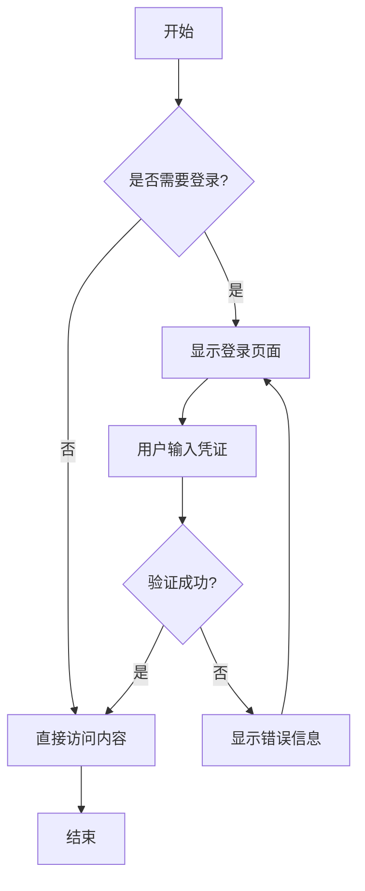

复杂流程图示例：

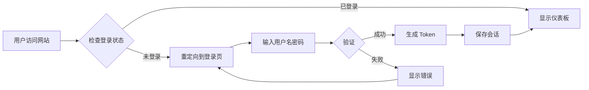

### 2. 时序图 (Sequence Diagram)

用户登录时序图：

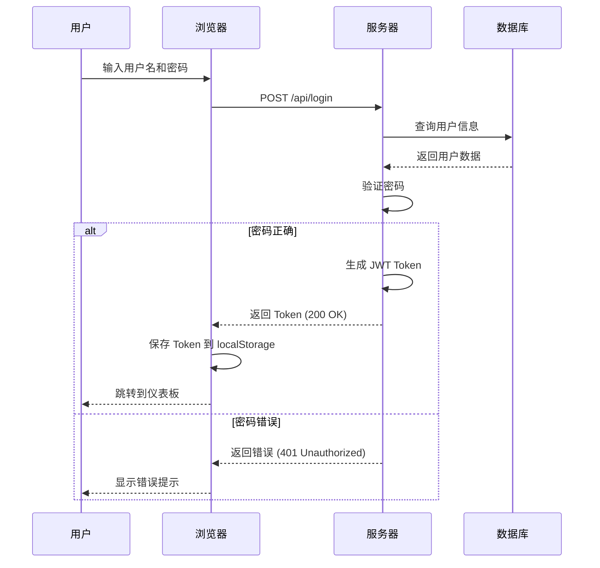

### 3. 状态图 (State Diagram)

订单状态流转：

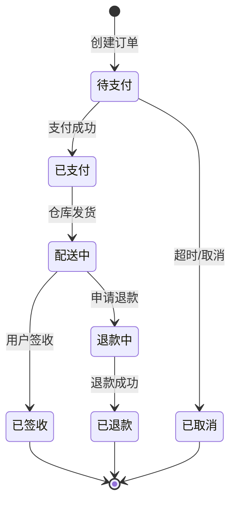

### 4. 类图 (Class Diagram)

博客系统类结构：

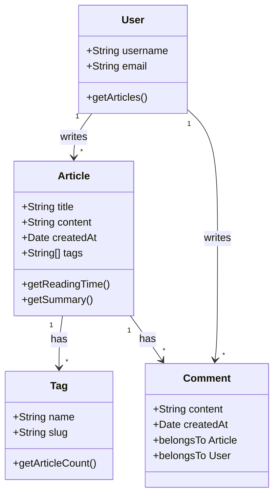

### 5. 实体关系图 (Entity Relationship)

数据库 ER 图：

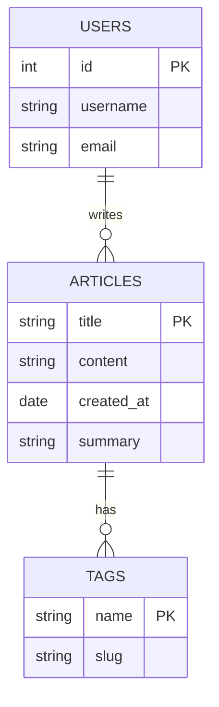

### 6. 甘特图 (Gantt Chart)

项目开发计划：

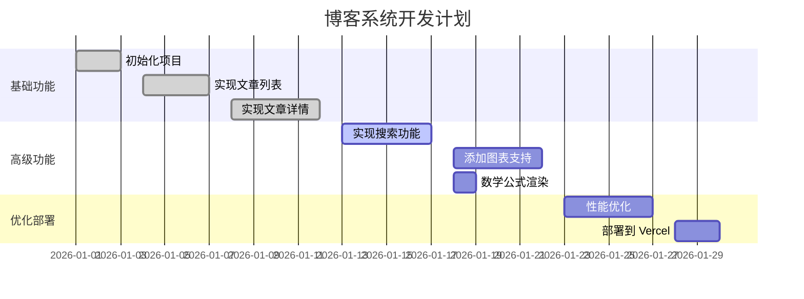

### 7. 饼图 (Pie Chart)

技术栈占比：

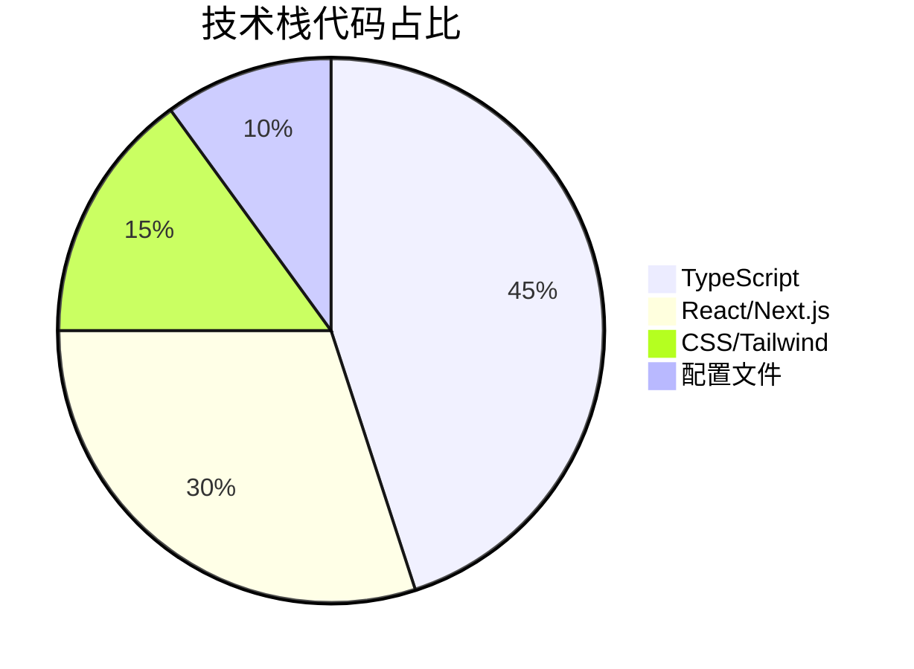

### 8. Git 图 (Git Graph)

版本控制历史：

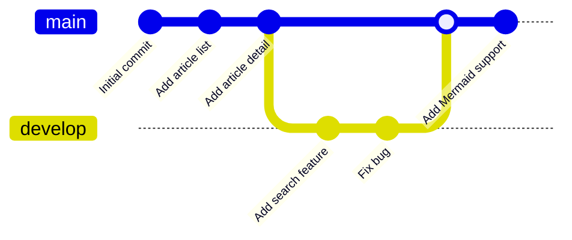

### 9. 思维导图 (Mindmap)

博客架构思维导图：

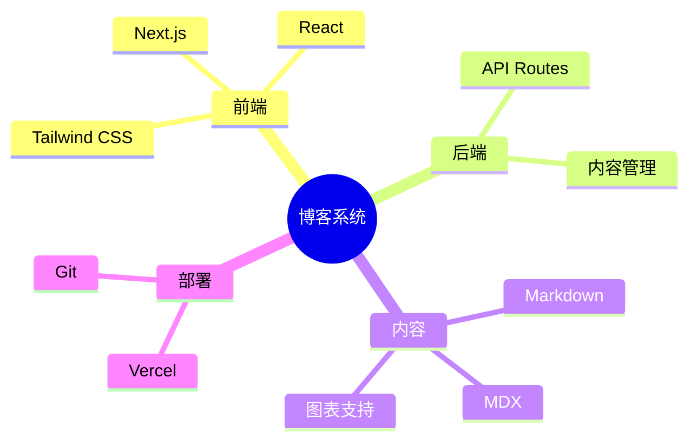

### 10. 时间线 (Timeline)

项目发展历程：

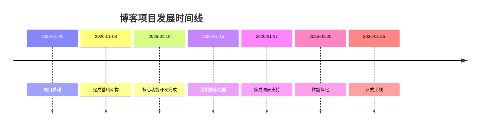

## 总结

Mermaid 提供了丰富的图表类型，可以满足技术博客中各种可视化需求：

- **流程图** - 展示业务流程和算法逻辑
- **时序图** - 描述系统交互和 API 调用
- **状态图** - 展示状态机转换
- **类图** - 展示面向对象设计
- **ER 图** - 展示数据库关系
- **甘特图** - 展示项目计划
- **饼图** - 展示数据占比
- **Git 图** - 展示版本控制历史
- **思维导图** - 展示知识结构
- **时间线** - 展示项目历程

使用方法：在 Markdown 代码块中指定 `mermaid` 语言，然后编写 Mermaid 语法即可。
